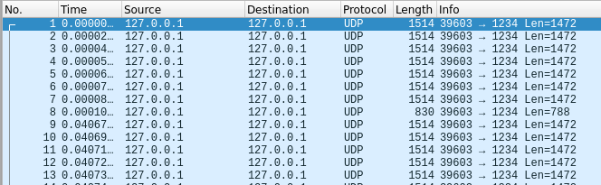
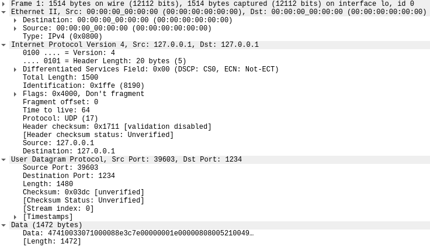
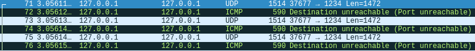
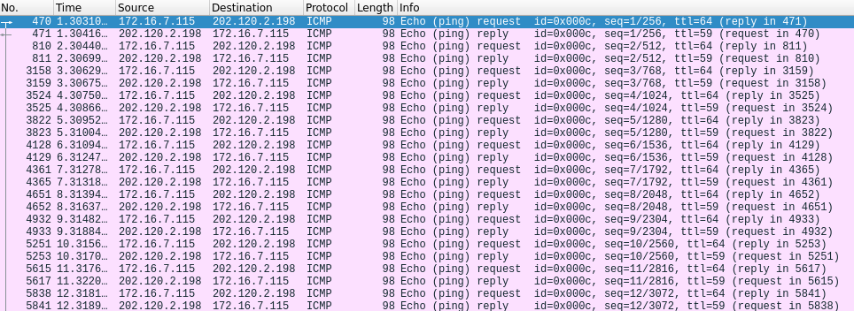
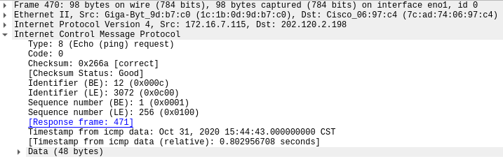
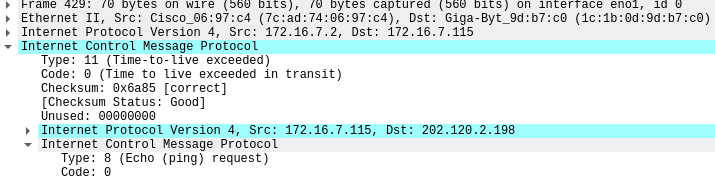

# hw3: wireshark

## 实验一，UDP报文格式抓包分析和IP层协议格式分析

### Enternet frame


### [IP协议](https://zh.wikipedia.org/wiki/IPv4)

IPv4报文的首部包含14个字段，其中13个是必须的，第14个是可选的（红色标出），并命名为：“选项”字段。首部中的字段均以[大端序](https://zh.wikipedia.org/wiki/大端序)包装，在以下的图表和讨论中，[最高有效位](https://zh.wikipedia.org/wiki/最高有效位)（Most Significant bit）被标记为0。

|   位偏移    |                        0–3                         |   4–7    |                    8–13                    |                            14-15                             |   16–18    | 19–31 |
| :---------: | :------------------------------------------------: | :------: | :----------------------------------------: | :----------------------------------------------------------: | :--------: | :---: |
|      0      |                        版本                        | 首部长度 |                  区分服务                  | [显式拥塞通告](https://zh.wikipedia.org/w/index.php?title=显式拥塞通告&action=edit&redlink=1) |    全长    |       |
|     32      |                       标识符                       |          |                                            |                                                              |    标志    |       |
|     64      | [存活时间](https://zh.wikipedia.org/wiki/存活時間) |          | [协议](https://zh.wikipedia.org/wiki/协议) |                                                              | 首部检验和 |       |
|     96      |                      源IP地址                      |          |                                            |                                                              |            |       |
|     128     |                     目的IP地址                     |          |                                            |                                                              |            |       |
|     160     |                选项（如首部长度>5）                |          |                                            |                                                              |            |       |
| 160 or 192+ |                        数据                        |          |                                            |                                                              |            |       |

### [UDP协议](https://zh.wikipedia.org/wiki/%E7%94%A8%E6%88%B7%E6%95%B0%E6%8D%AE%E6%8A%A5%E5%8D%8F%E8%AE%AE)

UDP协议头部

|  位  |    0 – 7     |    8 – 15    | 16 – 23 | 24 – 31 |
| :--: | :----------: | :----------: | :-----: | :-----: |
|  0  | 来源连接端口 | 目的连接端口 |         |         |
| 32  |   报文长度   |    检验和    |         |         |

### ffmpeg udp + wireshark实验

实验环境：

```bash
# 推流端
$ ffmpeg -re -stream_loop 1 -i ~/Videos/test.mp4 -codec copy -f mpegts udp://127.0.0.1:1234
# 播放端
$ ffplay udp://127.0.0.1:1234
```

wireshark filter: `udp.port == 1234`





根据上图，我们可以看到报文由几个部分组成：

- 链路层协议：Enternet II
  - MAC Header, dst, src 都是0
  - Type: 8表示IPv4

- IP头部
  - Version：4
  - Header Length： 20 bytes
  - Total Length: 1500
  - Protocol: UDP
- UDP头部
  - Source Port: 39603 
  - Destination Port: 1234
  - Length: 1480
- 猜测ffmpeg会从一个随机的端口向1234端口推流，如果没有客户端接受，会报ICMP的错误



## 实验二，任意网站三次握手过程和四次挥手过程抓包分析

### 三次握手过程分析

- 实验网站：www.douban.com
- wireshark filter`ip.addr == 154.8.131.172 and tcp.port == 57774`


- 第一次握手([SYN], Seq=100451098):

  客户端发送一个 TCP 的 SYN 标志位置1的包，指明客户端打算连接的服务器的端口，以及初始序号 X,保存在包头的序列号(Sequence Number)字段里。

  

- 第二次握手([SYN, ACK], Seq=1259568749, ACKnum=100451099):

  服务器发回确认包(ACK)应答。即 SYN 标志位和 ACK 标志位均为1。服务器端选择自己 ISN 序列号，放到 Seq 域里，同时将确认序号(Acknowledgement Number)设置为客户的 ISN 加1，即X+1。 

  

- 第三次握手([ACK]=1，ACKnum=1259568750)

  客户端再次发送确认包(ACK)，SYN 标志位为0，ACK 标志位为1，并且把服务器发来 ACK 的序号字段+1，放在确定字段中发送给对方，并且在数据段放写ISN的+1

  

#### 四次挥手过程分析

- 对一些网站的抓包分析中，大多数时候没有能够见到正常的四次挥手，比较偶然的时候遇到一次

#### 正常四次挥手

- 实验网站：www.douban.com
- wireshark filter`ip.addr == 202.120.2.198 and tcp.port==44982`


- 发起`Close`的是服务端
- 第一次挥手，服务端发送`[FIN,ACK]`，` Seq=43078, ACK=1136`
  - 表示服务端没有数据要发送，请求断开连接，进入`fin_wait_1` 状态（不能再发送数据到客户端，但能够发送控制信息 `ACK` 到客户端）。

- 第二次挥手，客户端发送 `[ACK]` 报文给服务端，` Seq=1136, ACK=43078`
  - 客户端收到 `[FIN]` 报文后，客户端知道不会再有数据从服务端传来，发送 `ACK` 进行确认，客户端进入 `close_wait` 状态。此时服务端收到了客户端对 `FIN` 的 `ACK` 后，进入 `fin_wait2` 状态。

- 第三次挥手，客户端发送 `[FIN,ACK]`报文给服务端`Seq=1136, ACK=43079`
  - 客户端发送 `[FIN,ACK]` 报文给对方，表示自己没有数据要发送了，客户端进入 `last_ack` 状态。服务端收到了客户端的 `FIN` 信令后，进入 `time_wait` 状态，并发送 `ACK` 确认消息。

- 第四次挥手，服务端发送 `[ACK]` 报文给客户端`Seq=43079, ACK=1137`
  - 服务端在 `time_wait` 状态下，等待 2MSL(MSL是数据分节在网络中存活的最长时间) 一段时间，没有数据到来的，就认为对面已经收到了自己发送的 `ACK` 并正确关闭了进入 `close` 状态，自己也断开了到客户端的 `TCP` 连接，释放所有资源。当客户端收到服务端的`ACK` 回应后，会进入 `close` 状态，并关闭本端的会话接口，释放相应资源。

### 非正常挥手


在一次`[TCP Keep-Alive]`包后，服务端发起挥手。

查阅资料感觉这个应该是发生了异常情况，但是我分析不出来是哪一端发生了什么问题。

- 第一次挥手，服务端发送`[FIN,ACK]`，` Seq=4572, ACK=1729`

- 第二次挥手，客户端发送 `[ACK]` 报文给服务端，` Seq=1729, ACK=4572`
  - 客户端收到 `[FIN]` 报文后，客户端知道不会再有数据从服务端传来，发送 `ACK` 进行确认，客户端进入 `close_wait` 状态。此时服务端收到了客户端对 `FIN` 的 `ACK` 后，进入 `fin_wait2` 状态。

- 第三次挥手，客户端发送 `[ACK]`报文给服务端`Seq=1729, ACK=4573`
  - 对比上一节正常的情况，这里没有`[FIN]`
- 第？？挥手，客户端发送`[RST,ACK]`报文给服务端，`Seq=1729, ACK=4573`

## 实验三，ICMP报文分析


### [ICMP 报文结构](https://zh.wikipedia.org/wiki/%E4%BA%92%E8%81%94%E7%BD%91%E6%8E%A7%E5%88%B6%E6%B6%88%E6%81%AF%E5%8D%8F%E8%AE%AE)

ICMP的全称是Internet Control Message Protocol

ICMP报头从IP报头的第160位开始（IP首部20字节）（除非使用了IP报头的可选部分）。

|  Bits   |    160-167     | 168-175 |      176-183       | 184-191 |
| :-----: | :------------: | :-----: | :----------------: | :-----: |
| **160** |      Type      |  Code   | 校验码（checksum） |         |
| **192** | Rest of Header |         |                    |         |

- **Type** - ICMP的类型,标识生成的错误报文；
- **Code** - 进一步划分ICMP的类型,该字段用来查找产生错误的原因.；例如，ICMP的目标不可达类型可以把这个位设为1至15等来表示不同的意思。
- **Checksum** - Internet校验和（[RFC 1071](https://tools.ietf.org/html/rfc1071)），用于进行错误检查，该校验和是从ICMP头和以该字段替换为0的数据计算得出的。
- **Rest of Header** - 报头的其余部分，四字节字段，内容根据ICMP类型和代码而有所不同。

### ICMP报文分析：Ping

#### Ping 介绍

> ping uses the ICMP protocol's mandatory ECHO_REQUEST datagram to elicit an ICMP ECHO_RESPONSE from a host or gateway. ECHO_REQUEST datagrams  (“pings”) have an IP and ICMP header, followed by a struct timeval and then an arbitrary number of “pad” bytes used to fill out the packet.

#### Ping + wireshark 实践

```bash
$ ping pt.sjtu.edu.cn
PING pt.sjtu.edu.cn (202.120.2.198) 56(84) bytes of data.
64 bytes from pt.sjtu.edu.cn (202.120.2.198): icmp_seq=1 ttl=59 time=1.08 ms
64 bytes from pt.sjtu.edu.cn (202.120.2.198): icmp_seq=2 ttl=59 time=2.61 ms
64 bytes from pt.sjtu.edu.cn (202.120.2.198): icmp_seq=3 ttl=59 time=0.494 ms
64 bytes from pt.sjtu.edu.cn (202.120.2.198): icmp_seq=4 ttl=59 time=1.18 ms
64 bytes from pt.sjtu.edu.cn (202.120.2.198): icmp_seq=5 ttl=59 time=0.539 ms
64 bytes from pt.sjtu.edu.cn (202.120.2.198): icmp_seq=6 ttl=59 time=1.55 ms
64 bytes from pt.sjtu.edu.cn (202.120.2.198): icmp_seq=7 ttl=59 time=0.416 ms
64 bytes from pt.sjtu.edu.cn (202.120.2.198): icmp_seq=8 ttl=59 time=2.45 ms
64 bytes from pt.sjtu.edu.cn (202.120.2.198): icmp_seq=9 ttl=59 time=4.04 ms
64 bytes from pt.sjtu.edu.cn (202.120.2.198): icmp_seq=10 ttl=59 time=1.47 ms
64 bytes from pt.sjtu.edu.cn (202.120.2.198): icmp_seq=11 ttl=59 time=4.41 ms
64 bytes from pt.sjtu.edu.cn (202.120.2.198): icmp_seq=12 ttl=59 time=0.793 ms
64 bytes from pt.sjtu.edu.cn (202.120.2.198): icmp_seq=13 ttl=59 time=3.39 ms
64 bytes from pt.sjtu.edu.cn (202.120.2.198): icmp_seq=14 ttl=59 time=0.459 ms
^C
--- pt.sjtu.edu.cn ping statistics ---
14 packets transmitted, 14 received, 0% packet loss, time 13017ms
rtt min/avg/max/mdev = 0.416/1.776/4.410/1.322 ms
```

wireshark filter: `ip.addr == 202.120.2.198 and icmp `



- src ping dst 第一个包
  - Type: 8 对应 Echo Request
  - Code:0 ，Type:8 只有一个Code类型，描述是Echo request (used to ping)
  - Sequence number: 1



- dst reply src 

  - Type: 0 对应 Echo Reply
  - Code:0 ，Type:0 只有一个Code类型，描述是Echo reply (used to ping)
  - Sequence number: 1后续不断递增

  

### ICMP报文分析：traceroute

#### traceroute 介绍

> traceroute  tracks  the route packets taken from an IP network on their way to a given host. It utilizes the IP protocol's time to  live  (TTL) field  and  attempts to elicit an ICMP TIME_EXCEEDED response from each gateway along the path to the host.

traceroute原理

1. 从源地址发出一个UDP探测包到目的地址，并将TTL设置为1；
2. 到达路由器时，将TTL减1；
3. 当TTL变为0时，包被丢弃，路由器向源地址发回一个ICMP超时通知（ICMP Time Exceeded Message），内含发送IP包的源地址，IP包的所有内容及路由器的IP地址；
4. 当源地址收到该ICMP包时，显示这一跳路由信息；
5. 重复1～5，并每次设置TTL加1；
6. 直至目标地址收到探测数据包，并返回端口不可达通知（ICMP Port Unreachable）；
7. 当源地址收到ICMP Port Unreachable包时停止traceroute。

#### traceroute + wireshark实践

```bash
$ traceroute pt.sjtu.edu.cn -I                                            
traceroute to pt.sjtu.edu.cn (202.120.2.198), 30 hops max, 60 byte packets
 1  _gateway (172.16.7.2)  0.564 ms  1.082 ms  1.333 ms
 2  202.120.39.254 (202.120.39.254)  2.745 ms  2.830 ms  2.825 ms
 3  10.22.35.253 (10.22.35.253)  0.849 ms  1.120 ms  1.232 ms
 4  10.3.2.53 (10.3.2.53)  1.543 ms  2.480 ms  2.901 ms
 5  10.32.33.254 (10.32.33.254)  1.273 ms  1.385 ms  1.380 ms
 6  pt.sjtu.edu.cn (202.120.2.198)  0.652 ms  0.976 ms  1.293 ms
```

wireshark filter: `icmp`


- 分析上图可以发现，traceroute每个ttl级别会发送三个包（防止丢包？），ICMP包设置了ttl，在数据包到达目标服务器之前，通过每个经过的路由器返回的ICMP超时通知来获知路径。
- 超时的包信息如下
  - Type: 11(Time-to-live exceeded)



- 当ttl=6时，我们收到了来自目标服务器的返回，traceroute结束