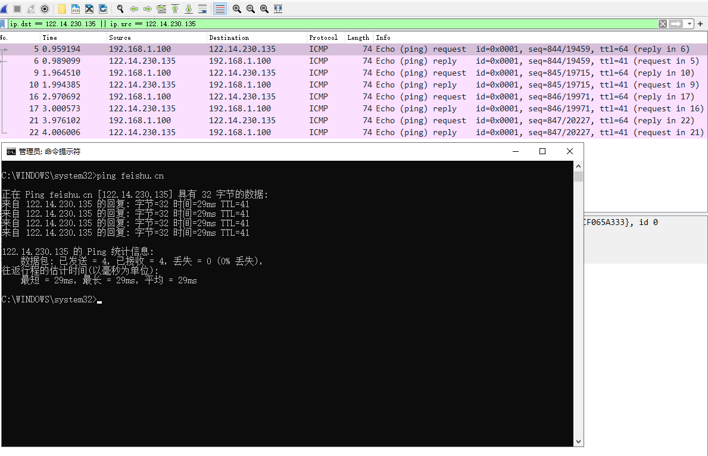
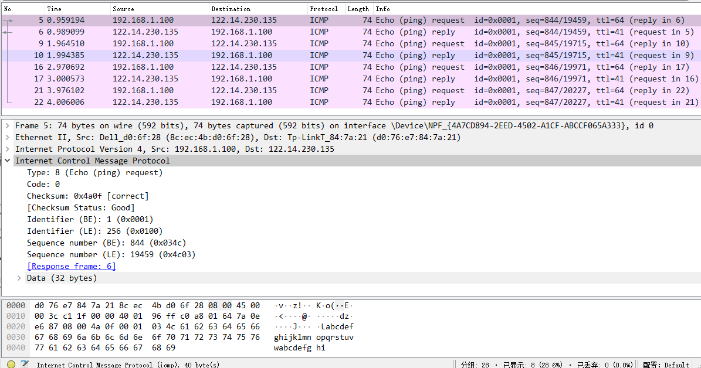
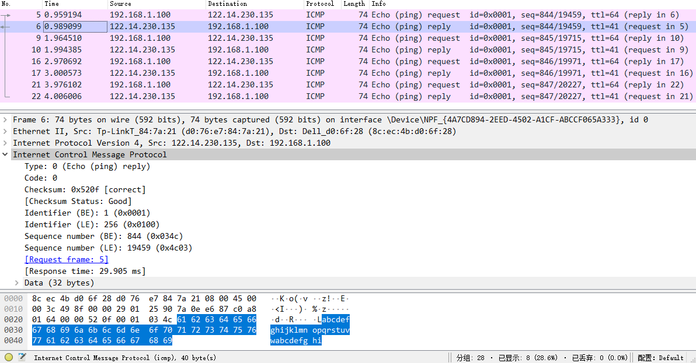

# 实验三 分析ping下的ICMP报文格式

使用wireshark抓取ping[飞书主页](https://www.feishu.cn)时的ICMP报文，并分析包中的结构和数据。

指令：

	ping feishu.cn
	
抓包时飞书的ip为`122.14.230.135`，结果如图，有来有回总共8个包，分为4组请求和回复,均为ICMP查询报文。

> ICMP是（Internet Control Message Protocol）Internet控制报文协议。它是TCP/IP协议簇的一个子协议，用于在IP主机、路由版器之间传递权控制消息.

> ICMP报文的种类有两种，即ICMP差错报告报文和ICMP询问报文。

ICMP 协议介于传输层和网络层之间。不能说它是网络层协议，是因为它依赖于所有的 IP 协议实现，ICMP 报文在传输过程中，又很可能被传输层解析处理。尽管如此，我们通常仍然认为 ICMP 协议是网络层协议。维基百科对此有如下解释：

> ICMP 协议使用了 IP 协议的基本支持，以至于它好像是更高层的协议。然而, ICMP 协议实际上是 IP 协议的一个组成部分。尽管 ICMP 报文被封装在标准 IP 协议包中，但与一般的 IP 包处理不同，ICMP 报文通常作为特殊情况处理。
> 
> (ICMP uses the basic support of IP as if it were a higher level protocol, however, ICMP is actually an integral part of IP. Although ICMP messages are contained within standard IP packets, ICMP messages are usually processed as a special case, distinguished from normal IP processing. )

关于ICMP报文的背景知识参考[ICMP报文](https://www.cnblogs.com/wanghao-boke/p/11670473.html)

ICMP报文的具体格式

## 请求包分析

仅分析ICMP报文部分

	#ICMP协议
    Internet Control Message Protocol
	#8位类型，Type为8是请求回复报文（Echo）
    Type: 8 (Echo (ping) request)
	#占8位，Type和Code一起决定了ICMP报文的类型。
    Code: 0 
	#16位的检验和字段，包含数据在内的整个ICMP数据包的检验和，其计算方法和IP头部检验和的计算方法一样的。
    Checksum: 0x4a0f [correct] #检验和正确
    [Checksum Status: Good]
	#ICMP报文中的标识符和序列号字段由发送端任意选择设定，这些值在应答中将被返回，这样，发送端就可以把应答与请求进行匹配。
	#标识符
    Identifier (BE): 1 (0x0001)
    Identifier (LE): 256 (0x0100)
	#序列编号
    Sequence number (BE): 844 (0x034c)
    Sequence number (LE): 19459 (0x4c03)
    [Response frame: 6]
	#请求回复的数据
    Data (32 bytes)

## 回复包分析

    #ICMP协议
    Internet Control Message Protocol
    #8位类型，Type为0是回复报文（Echo reply）
    Type: 0 (Echo (ping) reply)
    #占8位，Type和Code一起决定了ICMP报文的类型。
    Code: 0
    #16位的检验和字段，包含数据在内的整个ICMP数据包的检验和，其计算方法和IP头部检验和的计算方法一样的。
    Checksum: 0x520f [correct] #检验和正确
    [Checksum Status: Good]
    #ICMP报文中的标识符和序列号字段由发送端任意选择设定，这些值在应答中将被返回，这样，发送端就可以把应答与请求进行匹配。
    #标识符
    Identifier (BE): 1 (0x0001)
    Identifier (LE): 256 (0x0100)
    #序列编号
    Sequence number (BE): 844 (0x034c)
    Sequence number (LE): 19459 (0x4c03)
    [Request frame: 5]
    #通过在ICMP报文中存放发送请求的时间值来计算往返时间。当应答返回时，用当前时间减去存放在ICMP报文中的时间值，即是往返时间。
    [Response time: 29.905 ms] #回复用时29.905 ms
    #回复的数据
    Data (32 bytes)

