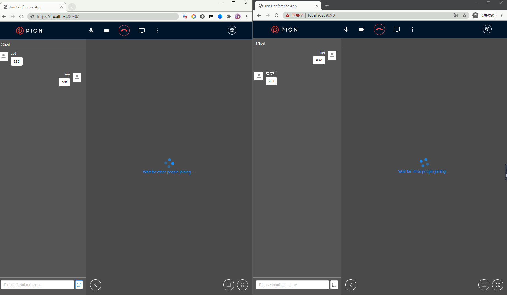
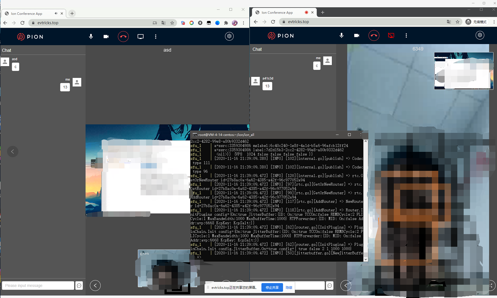
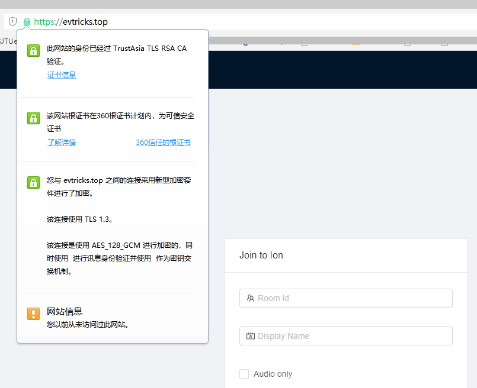

# 在自己的电脑上安装ION

按照课程pdf中的进行即可，不过要记得在docker-compose up之前要开启docker服务（桌面端或者命令行都行）

通过docker-compose up -d可以使用detach功能，可以一个窗口开启多个容器服务。

中间遇到一个情况是5353端口总是被我的浏览器占用，一种方法是查找端口占用的程序并关闭进程。
另一种方法是修改`docker-compose.yml`和`sfu.toml`中的sfu端口。

# 将ION部署到公网

### 网址是[evtricks.top](https://evtricks.top)

### &nbsp;&nbsp;&nbsp;&nbsp;&nbsp;&nbsp;网址是[evtricks.top](https://evtricks.top)

### &nbsp;&nbsp;&nbsp;&nbsp;&nbsp;&nbsp;&nbsp;&nbsp;&nbsp;&nbsp;&nbsp;&nbsp;网址是[evtricks.top](https://evtricks.top)

 

怎么访问都可以，已经设置了重定向为https链接。**~~ev就是我名字的字母发音XD~~**

第一次在外网服务器搭建网站，过程还是相当曲折的，我把过程就记录到了[博客](https://www.cnblogs.com/smileglaze/p/13991905.html)里，在11月22日之后就可以访问了。
最终效果如图，电脑没有摄像头，开了两个浏览器窗口，再加上一个手机浏览器访问的画面。

由于不熟悉caddy，这个ssl证书该怎么解决也花了些功夫。

# 实现ION中的SFU级联功能
待更新
