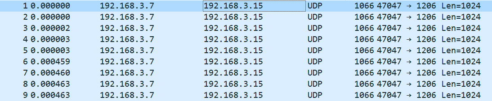
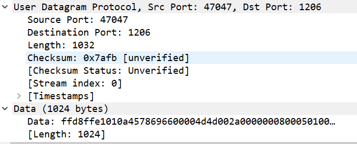
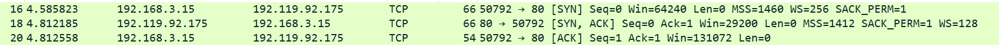
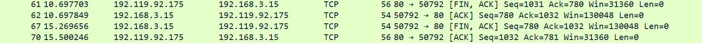
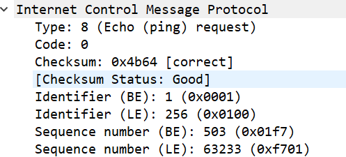

# 实验一

通过UDP客户端向UDP服务端发送图片文件

客户端：192.168.3.7:47047

服务端：192.168.3.15:1206

UDP头包括 源端口，目的端口，总长度，校验码

# 实验二

## 三次握手

客户端：192.168.3.15

服务器:    192.119.92.175

客户端先发送SYN建立请求，服务端回复SYN,ACK，接着客户端回复ACK。至此完成了源端口49864的三次握手。

## 四次挥手

客户端：192.168.3.15

服务器:    192.119.92.175

服务端先发送[FIN,ACK]的断开连接请求，客户端回复[ACK]，之后客户端发送[FIN,ACK]的断开连接请求，服务端回复[ACK]至此完成四次挥手的过程。

# 实验三

客户端：192.168.3.15

服务器:    192.119.92.175

当ping服务器时，客户端发送ICMP包，为查询报文。

然后服务器回复的ICMP包为差错报告报文。

