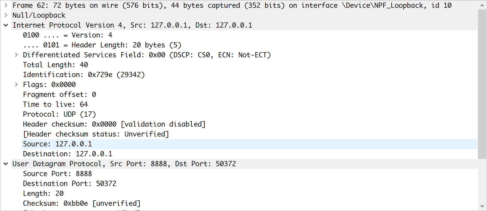
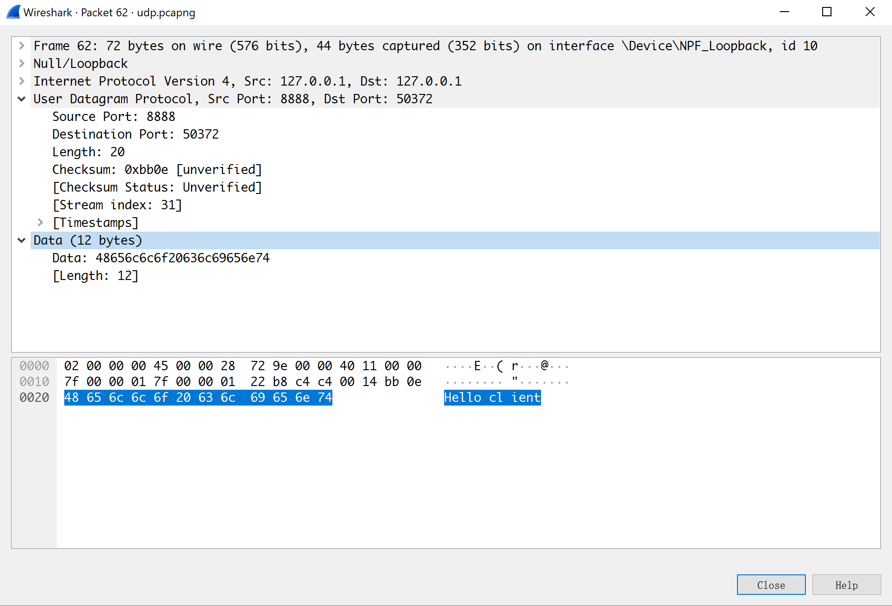

运行code目录下的UDP服务端和客户端，使用wireshark可以捕获到下面的包

其中端口号为8888的为服务端，50372为客户端随机使用的端口号

下面以服务端进行说明

> UDP协议基于IP协议，是一种面向无连接的协议，这使得UDP比面向连接的TCP连接要简单许多。如下图在IP首部的Protocol的值为17，表示使用的协议为UDP 。同时我们可以观察到首部的校验和被关闭了，据此我们也可以推测UDP的不可靠性。

> 在用户数据报协议层，我们可以观察到本次UDP数据传输的相关信息，源点端口为8888，目的端口为50372，Length标志着UDP数据报的长度(最小为8byte)，检验和用于差错控制，但是在UDP中不强制使用，属于可选项。
>
> Data表示传输的数据，其长度可变，但是也有上限，因为在UDP头部的Length只有16位，在这里我们可以知道此次发送的数据即为"Hello client"

