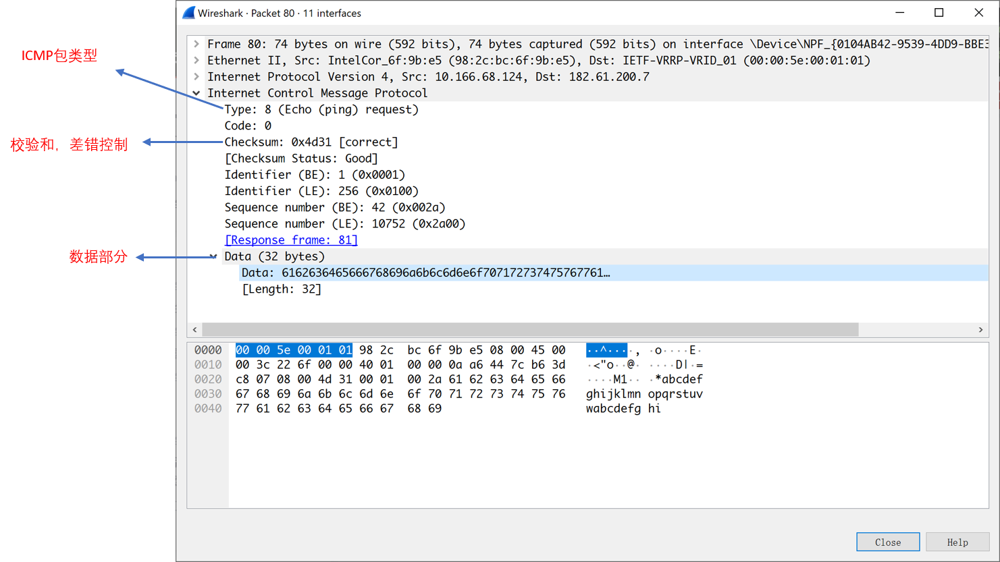
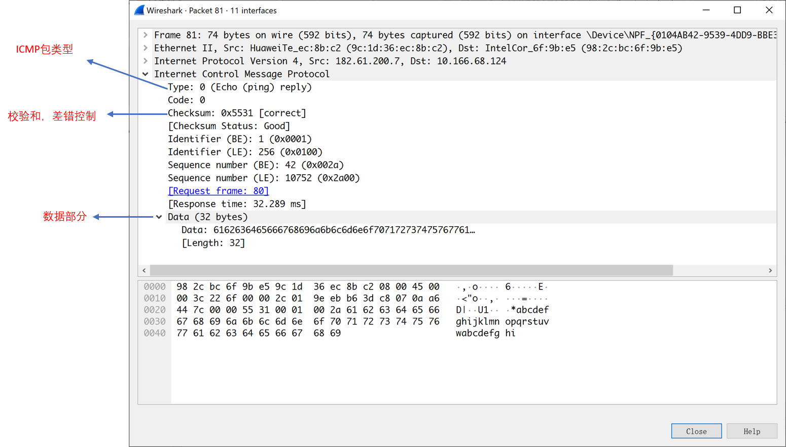

ICMP是一个依赖IP实现的协议，可以用来判断网络是否通畅。

下图是本地`ping`百度(baidu.com)时捕获到的ICMP包

> 在IP头部上看，我们可以看到其中的协议号为1，也就是ICMP

####  请求报文 echo request

> 本地ping百度，可以注意到此时Type类型为8，也就是echo request请求报文
>
> Type和Code可以构成不同的报文类型
>
> Checksum是检验和，可以用来进行差错控制
>
> Identifier分为LE，BE，分别匹配不同的字节顺序(小端，大端)，但实际上表示的大小是一样的
>
> Sequence number表示序列号，也分成LE、BE类似Identifier
>
> > 标识符和序列号用于匹配回显应答和回显请求
>
> Data是携带的数据部分

#### 回复报文

> 百度回复本地的ping包，此时Type为0，也就是echo reply回复报文，其余字段类似echo request

