## 三次握手

下面是本地访问百度时，使用`Wireshark`对TCP三次握手捕获的包

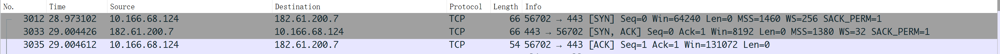

首先根据图示简单说明一下三次握手的过程：

本地(src: 10.166.68.124)向百度服务器(src: 182.61.200.7)发送一个`SYN`包，请求与百度服务器建立连接，百度端接收到这个`SYN`包之后，觉得可以进行连接，然后就向本地回复了一个`SYN,ACK`包，本地接收到了这个包之后，确认自己收到了这个包，于是乎在向百度端发送一个`ACK`包，之后连接建立，可以进行通信。

先看看三次握手过程中IP层的协议

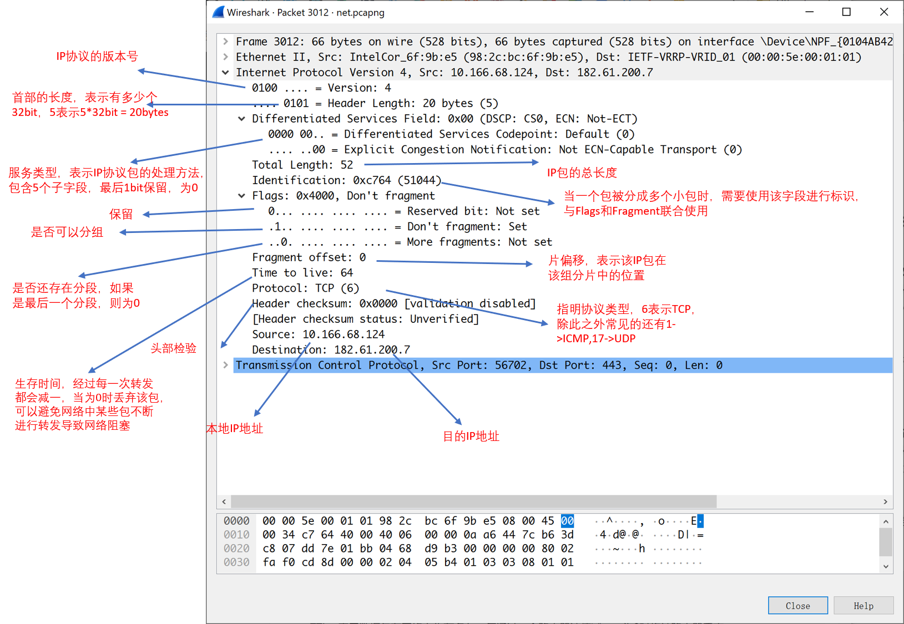> 

> IP层中有一个协议(Protocol)的标志，在这里为6，表示所使用的协议为TCP，IP协议的主要功能是建立点到点的连接，而传输层的连接则是端到端的，可以将数据从一个进程传到另一个进程。

#### 第一次握手：SYN包

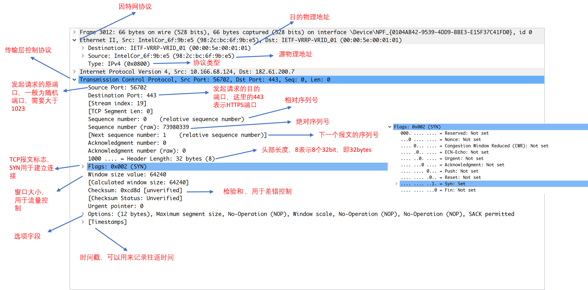

> 本地向百度端发送SYN包，请求建立建立。
>
> Flags的取值标识了该包为SYN包，可以看出只有Syn字段设置为1，其余为0。发送的SYN包中的初始的相对序列号seq设置为0，ack也为0。发送的时候发送端口是随机的一个端口，这里为56702，目的端口为443，表示请求的服务类型为HTTPS

#### 第二次握手：SYN/ACK包

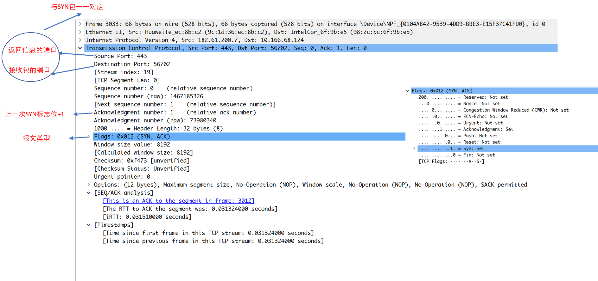

> 百度回复的SYN/ACK包
>
> Flags中标识了本包类型，ACK和SYN位都设置为1，其余位为0。
>
> 发送的包中ACK设置为1，是SYN包中序列号+1所得

#### 第三次握手：ACK包

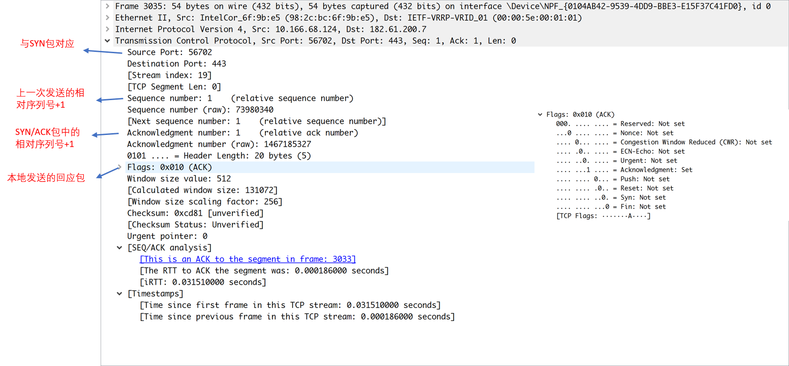

> 本地向百度端发送的ACK包
>
> Flags中标识了本包类型，ACK位置为1，其余位为0。
>
> 本包中的源端口和目的端口和第一次握手时候的一致，属于同一次通信，seq设置为1，是第一次握手时序列号+1所得，ACK为1，为第二次握手百度端发送包中的seq+1所得

## 四次挥手

下面是四次挥手使用wireshark捕获到的包(非百度)

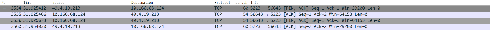

#### 第一次挥手：FIN包

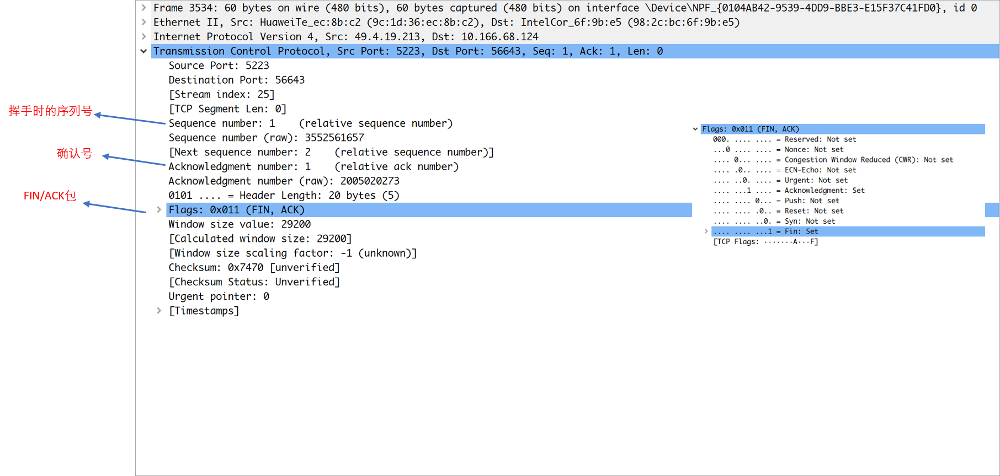

> 远端向本地发送的一个FIN/ACK包
>
> 我们可以将这个FIN包认为是四次挥手时候，需要请求断开连接的那一端发送的FIN请求，设置了ACK是因为需要对上一个包进行确认，否则信源端会认为发送出去的包由于某些原因没有被接收到而重发。

#### 第二次挥手：ACK包

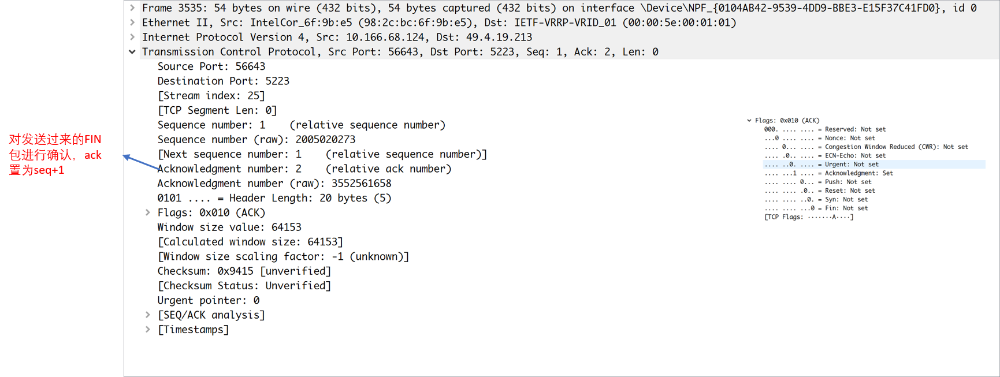

> 本地向远端发送一个ACK包，表示确认收到了FIN包
>
> Flags里面ACK置为1，其余为0，表示为确认包。

#### 第三次挥手：FIN包

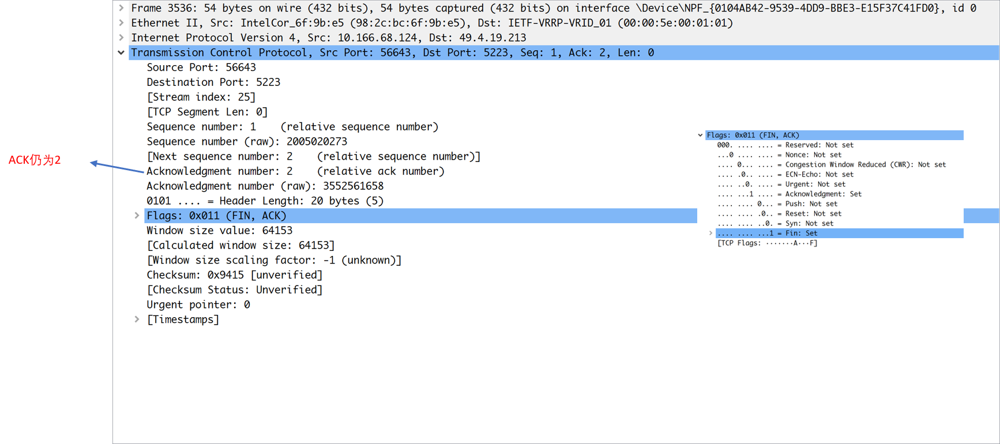

>本地对远端发送FIN/ACK包
>
>在接收到远端发送的FIN包之后，本地马上向远端发送ACK进行确认，由于本地可能还需要一部分数据需要发送或者其他事情需要进行处理，所以等到数据全部发送完成之后，本地向远端发送FIN包

MENTION：在wireshark上面抓包的时候，我们可能只抓到四次挥手中的三个包，但是其实这三个包已经是完整的四次挥手了，比如下图，第二个FIN/ACK其实是将FIN、ACK包一同发了出去。

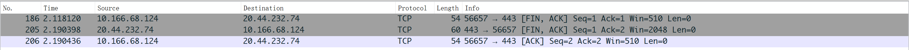

#### 第四次挥手：ACK包

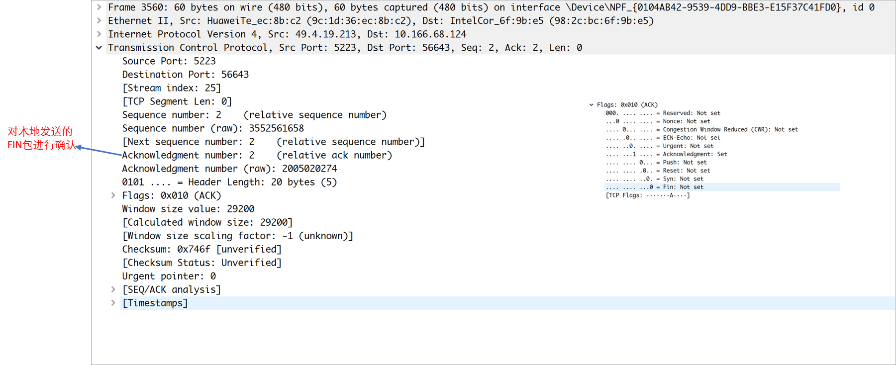

> 远端向本地发送ACK包表示确认收到了FIN包
>
> 本地接收到ACK包之后关闭连接。